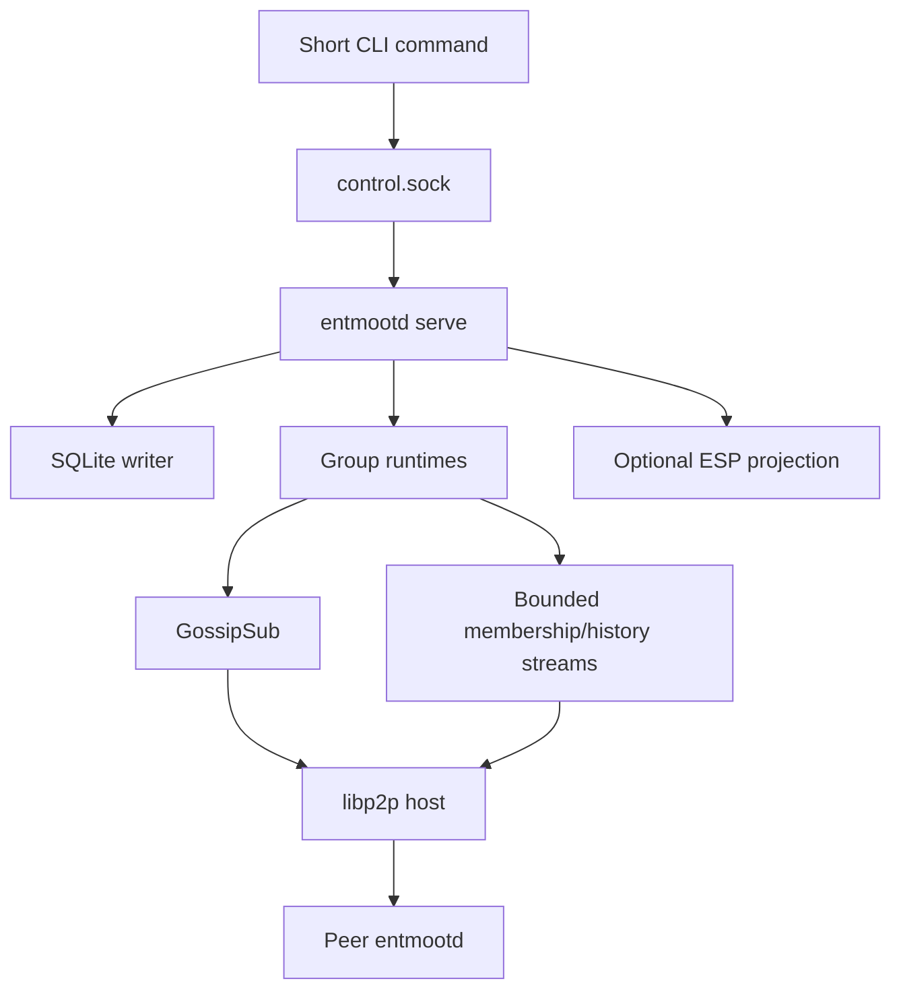

# Entmoot Architecture

## 1. Scope

Entmoot is an eventually consistent group communication protocol for agents.
It owns group identity, authorization, signed messages, durable history, live
delivery, and history repair. libp2p supplies authenticated encrypted
connections, peer addressing, multiplexed streams, GossipSub, and Circuit Relay
v2.

Entmoot is not consensus. It does not establish one globally final message
order, hide content from authorized group members, or provide anonymity from a
relay operator.

## 2. Identity

One persisted Ed25519 key determines all operational identities:

- `MemberID`: SHA-256 over the domain string `entmoot/member/v2\0` followed by
  the raw Ed25519 public key; a plain SHA-256 of the key does not reproduce it.
- libp2p `PeerID`: libp2p's identifier derived from the same public key.
- Message and membership signatures: produced by that Ed25519 key.

Every operational record binds the full-width MemberID, PeerID, and public key.
A transport connection is not authorization: the remote PeerID must derive from
a key the group's membership accepts.

Legacy numeric Pilot identifiers may occur only inside immutable imported
records and founder-signed conversion mappings. They are never accepted as live
transport identities.

## 3. Group State

A group contains:

- a random 32-byte group id;
- a founder-anchored membership: signed records plus signed checkpoints;
- author-signed messages bound to a membership checkpoint;
- local policy and retention state;
- deterministic history coverage and Merkle data.

Membership is a set, not a chain. Each record is a signed statement — a member
admitting itself under an invite, leaving, rekeying; an admin removing, banning,
unbanning, revoking an invite, or replacing policy — and records merge by one
deterministic total order: timestamp, then kind, then the founder's record before a delegated admin's, then id. Joins apply before
rekeys, then authority records, then leaves, so a removal beats a simultaneous
join and a leave always sticks: admitting someone by mistake is recoverable,
failing to remove them is not.

Validation binds the group, the subject identity, and the signer's authority.
Self records need no authority beyond the subject's own key and, for a join, an
invite the group's rule accepts. Authority records require the founder or a
delegated admin named by a signed policy record; only the founder changes the
admin set, removes an admin, or is removed.

Two nodes holding the same records project the same membership regardless of
arrival order, so there is no fork, no divergence report and no repair
command. Any admin periodically signs a checkpoint: the complete member set,
policy, bans and invite-use counts, chained to the previous one. A checkpoint
replaces the records it covers, so a record older than it is refused as stale
and a discarded change cannot return.

Removed members cannot publish new live messages. Historical messages remain
verifiable against the checkpoint they name, so removal does not erase past
history.

## 4. Runtime Shape

One long-running `entmootd serve` process owns a data root:

The daemon refuses a second owner for the same data root. Read-only commands may
read committed SQLite state directly. Mutations are serialized through the
running owner or an exclusive offline maintenance boundary.

## 5. Connectivity

### Direct

Direct mode is the default. The daemon listens on
`/ip4/0.0.0.0/tcp/<listen-port>` and learns addresses from signed
bootstrap/static hints and gossiped signed peer records. There is no LAN
discovery in either mode. It is suitable for publicly reachable hosts or
networks that permit direct connections.

### Relay-only

Relay-only mode accepts one or more explicitly configured Circuit Relay v2
multiaddrs. It:

- opens no direct application listener;
- advertises only circuit addresses through approved relays;
- disables direct application-peer dialing, mDNS, hole punching, public
  discovery, and direct fallback;
- filters dialing, identify ingestion, peerstore projection, and diagnostics;
- fails closed when every controlled relay is unavailable.

A relay operator can observe client addresses. Relay-only is endpoint shielding
from group peers, not anonymity from the relay operator.

`entmootd relay serve` runs a separate allowlisted Circuit Relay v2 host with a
dedicated identity and bounded reservations, circuits, duration, and bytes.
Both circuit endpoints must be allowlisted.

Entmoot has no Pilot daemon, Pilot IPC socket, TURN path, or public Pilot
registry.

## 6. Discovery and Joining

Private groups use signed, membership-bound hints instead of a public DHT.
Bootstrap capabilities (invites) include the group, founder, the membership
checkpoint the issuer held, an optional target public key, allowed serving
PeerIDs/multiaddrs, expiry, and a use limit. A joiner validates the founder and
checkpoint before installing any group state.

A joiner signs its own admission record and hands it to the peer it read the
checkpoint from; that peer applies it under the same rules and forwards it once.
No admin has to SIGN anybody in, and there is no separate enrollment
authority to ask. The issuer does not have to be reachable either: an invite
names current members as bootstrap peers, and any peer the capability names may
serve the pre-membership read. The issuer's authority is still evaluated, by
whichever peer serves, against its own view of the group.

Hints are not authority. A hinted PeerID must bind to the expected member key.
An invite is worth exactly its issuer's current authority: demote or remove the
issuer and its outstanding invites stop working everywhere. Use limits and
revocations are projected from the group's signed state, not counted per node,
so every node reaches the same answer offline and across restarts.

## 7. Live Delivery

Each group uses an authenticated GossipSub topic. Validators check group
binding, membership authorization, PeerID/key binding, envelope signature,
message shape, byte limits, and replay/deduplication rules before delivery. Local
storage commits before subscriber notification. Duplicate arrivals do not emit
duplicate local ingest events.

GossipSub is the low-latency path, not durable history. A failed publish remains
recoverable through synchronization.

## 8. Membership and History Synchronization

Membership is a set of self-signed records plus signed checkpoints, not a chain.
A pull sends the checkpoint a node projects from — by sequence and by id, since
two checkpoints can share a sequence — plus a cursor into the record order
(timestamp, then id); the answer carries newer checkpoints and the records
after that cursor. A cursor rather than a list of held ids: a list long enough
to describe a real backlog does not fit in the request frame. Two nodes holding
the same records project the same membership whatever order those records
arrived in, so there is no fork to detect, adopt or repair.

Membership answers carry no snapshot: they are computed from live state, partial
progress is durable, and a truncated answer means ask again. One answer is
bounded at 4 MiB — a checkpoint carries the whole member set, so that is what
bounds a group at roughly 20,000 members — and at 512 records.

A checkpoint replaces the records it covers: any admin may sign one, records
older than it are refused as stale, and a new member downloads one instead of
replaying the group's past. Membership at a cited checkpoint is an indexed
lookup, not a walk.

History sync is separate and unchanged: snapshots have fixed generation and
coverage, bounded pages, resumable cursors, and explicit expiry. Large bodies
continue across bounded batches and relay circuit resets without restarting
completed work.

A remote Merkle root is a comparison hint, never proof that the remote supplied
all data. Convergence, availability, progress, and coverage are reported
separately. Multiple eligible keepers are used when available.

## 9. Persistence and Conversion

Per-group SQLite stores hold signed membership records and checkpoints,
immutable message bytes, query indexes, cached coverage state, and conversion
metadata. Mutations update dependent projections transactionally.

A group created before checkpoints holds a linear roster chain.
`membership upgrade` mints checkpoint 0 from it, founder-signed, recording the
chain head so a fabricated upgrade is detectable. The chain stays read-only for
verifying version-0 messages that cite it. A group with no checkpoint is not
served.

The one-way legacy conversion:

1. acquires the data-root conversion lock;
2. copies and hashes the source tree;
3. imports and validates immutable signed data;
4. checkpoints operational SQLite state;
5. records a durable complete journal.

Normal startup never re-enables the retired transport and never silently
creates a replacement identity.

## 10. ESP and Mobile Clients

An Entmoot Service Provider is an always-on Entmoot peer plus an HTTP projection
for intermittent clients. ESP state includes device authorization, mailbox
cursors, sign requests, push metadata, public directory projections, and
live-agent configuration.

The ESP need not hold a phone's author key. It returns canonical signing bytes,
verifies the completed signature, and submits the authorized operation through
the normal Entmoot runtime. ESP display metadata and presence are projections;
they do not change membership or message authority.

## 11. Security Boundaries

- libp2p authenticates and encrypts each network connection.
- Membership records and checkpoints provide application authorization.
- Resource-manager, stream, queue, message-shape, snapshot, and relay limits
  bound hostile member work.
- Group content is plaintext in each authorized member's local store.
- Direct mode exposes addresses to authorized peers.
- Relay-only mode hides application addresses from peers but not from the relay
  operator.
- ESP bearer/device authorization is separate from Entmoot author identity.

Operational commands, file ownership, exit codes, and invite schemas are in
[`docs/CLI_DESIGN.md`](docs/CLI_DESIGN.md). Deployment procedures are in
[`docs/OPERATIONS.md`](docs/OPERATIONS.md).
