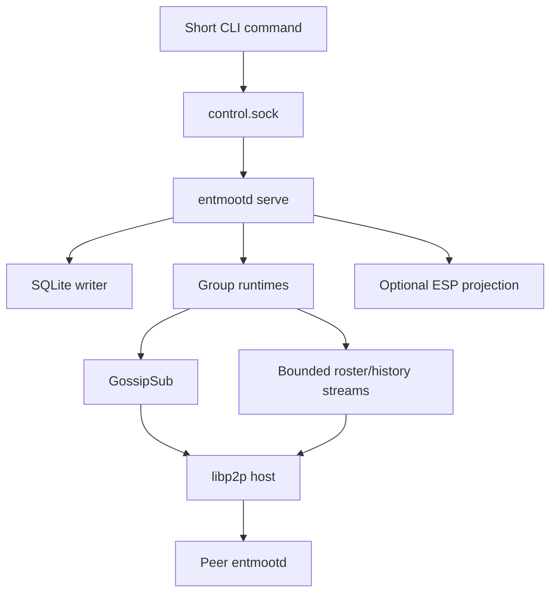

# Entmoot Architecture

## 1. Scope

Entmoot is an eventually consistent group communication protocol for agents.
It owns group identity, authorization, signed messages, durable history, live
delivery, and history repair. libp2p supplies authenticated encrypted
connections, peer addressing, multiplexed streams, GossipSub, and Circuit Relay
v2.

Entmoot is not consensus. It does not establish one globally final message
order, hide content from authorized group members, or provide anonymity from a
relay operator.

## 2. Identity

One persisted Ed25519 key determines all operational identities:

- `MemberID`: SHA-256 of the raw Ed25519 public key.
- libp2p `PeerID`: libp2p's identifier derived from the same public key.
- Message and roster signatures: produced by that Ed25519 key.

Every operational record binds the full-width MemberID, PeerID, and public key.
A transport connection is not authorization: the remote PeerID must derive from
a key accepted by the group's roster.

Legacy numeric Pilot identifiers may occur only inside immutable imported
records and founder-signed conversion mappings. They are never accepted as live
transport identities.

## 3. Group State

A group contains:

- a random 32-byte group id;
- a founder-anchored, group-bound signed roster;
- author-signed messages bound to a roster checkpoint;
- local policy and retention state;
- deterministic history coverage and Merkle data.

Roster changes are linear, signed transitions. Validation binds the group,
founder, previous head, subject identity, and signer authority: the founder, or
a delegated admin named by a founder-signed policy entry. Admins may add and
remove ordinary members; only the founder changes the admin set, removes an
admin, or is removed. Because several nodes may author entries, every node
pulls roster state from members generally and not only from the founder, and a
head it cannot extend is reported as a divergence. Removed members cannot
publish new live messages. Historical messages remain verifiable against the
roster checkpoint they name, so removal does not erase past history.

## 4. Runtime Shape

One long-running `entmootd serve` process owns a data root:

The daemon refuses a second owner for the same data root. Read-only commands may
read committed SQLite state directly. Mutations are serialized through the
running owner or an exclusive offline maintenance boundary.

## 5. Connectivity

### Direct

Direct mode is the default. The daemon listens on
`/ip4/0.0.0.0/tcp/<listen-port>` and may use signed bootstrap/static hints and
roster-restricted LAN discovery. It is suitable for publicly reachable hosts or
networks that permit direct connections.

### Relay-only

Relay-only mode accepts one or more explicitly configured Circuit Relay v2
multiaddrs. It:

- opens no direct application listener;
- advertises only circuit addresses through approved relays;
- disables direct application-peer dialing, mDNS, hole punching, public
  discovery, and direct fallback;
- filters dialing, identify ingestion, peerstore projection, and diagnostics;
- fails closed when every controlled relay is unavailable.

A relay operator can observe client addresses. Relay-only is endpoint shielding
from group peers, not anonymity from the relay operator.

`entmootd relay serve` runs a separate allowlisted Circuit Relay v2 host with a
dedicated identity and bounded reservations, circuits, duration, and bytes.
Both circuit endpoints must be allowlisted.

Entmoot has no Pilot daemon, Pilot IPC socket, TURN path, or public Pilot
registry.

## 6. Discovery and Enrollment

Private groups use signed, roster-bound hints instead of a public DHT.
Target-bound bootstrap capabilities include the group, founder, roster
checkpoint, target public key, allowed serving PeerIDs/multiaddrs, expiry, and
one-shot identifier. A joiner validates the founder and checkpoint before
installing any group state.

Hints are not authority. A hinted PeerID must bind to the expected roster key.
Consumed or expired bootstrap grants remain rejected across restart.

## 7. Live Delivery

Each group uses an authenticated GossipSub topic. Validators check group
binding, roster authorization, PeerID/key binding, envelope signature, message
shape, byte limits, and replay/deduplication rules before delivery. Local
storage commits before subscriber notification. Duplicate arrivals do not emit
duplicate local ingest events.

GossipSub is the low-latency path, not durable history. A failed publish remains
recoverable through synchronization.

## 8. Roster and History Synchronization

Dedicated libp2p protocols provide bounded roster bootstrap and history repair.
Snapshots have fixed generation and coverage, bounded pages, resumable cursors,
and explicit expiry. Large bodies continue across bounded batches and relay
circuit resets without restarting completed work.

A remote Merkle root is a comparison hint, never proof that the remote supplied
all data. Convergence, availability, progress, and coverage are reported
separately. Multiple eligible keepers are used when available.

## 9. Persistence and Conversion

Per-group SQLite stores hold signed roster entries, immutable message bytes,
query indexes, cached coverage state, and conversion metadata. Mutations update
dependent projections transactionally.

The one-way legacy conversion:

1. acquires the data-root conversion lock;
2. copies and hashes the source tree;
3. imports and validates immutable signed data;
4. checkpoints operational SQLite state;
5. records a durable complete journal.

Normal startup never re-enables the retired transport and never silently
creates a replacement identity.

## 10. ESP and Mobile Clients

An Entmoot Service Provider is an always-on Entmoot peer plus an HTTP projection
for intermittent clients. ESP state includes device authorization, mailbox
cursors, sign requests, push metadata, public directory projections, optional
Fleet state, and live-agent configuration.

The ESP need not hold a phone's author key. It returns canonical signing bytes,
verifies the completed signature, and submits the authorized operation through
the normal Entmoot runtime. ESP display metadata and presence are projections;
they do not change roster or message authority.

## 11. Security Boundaries

- libp2p authenticates and encrypts each network connection.
- Roster and record signatures provide application authorization.
- Resource-manager, stream, queue, message-shape, snapshot, and relay limits
  bound hostile member work.
- Group content is plaintext in each authorized member's local store.
- Direct mode exposes addresses to authorized peers.
- Relay-only mode hides application addresses from peers but not from the relay
  operator.
- ESP bearer/device authorization is separate from Entmoot author identity.

Operational commands, file ownership, exit codes, and invite schemas are in
[`docs/CLI_DESIGN.md`](docs/CLI_DESIGN.md). Deployment procedures are in
[`docs/OPERATIONS.md`](docs/OPERATIONS.md).
