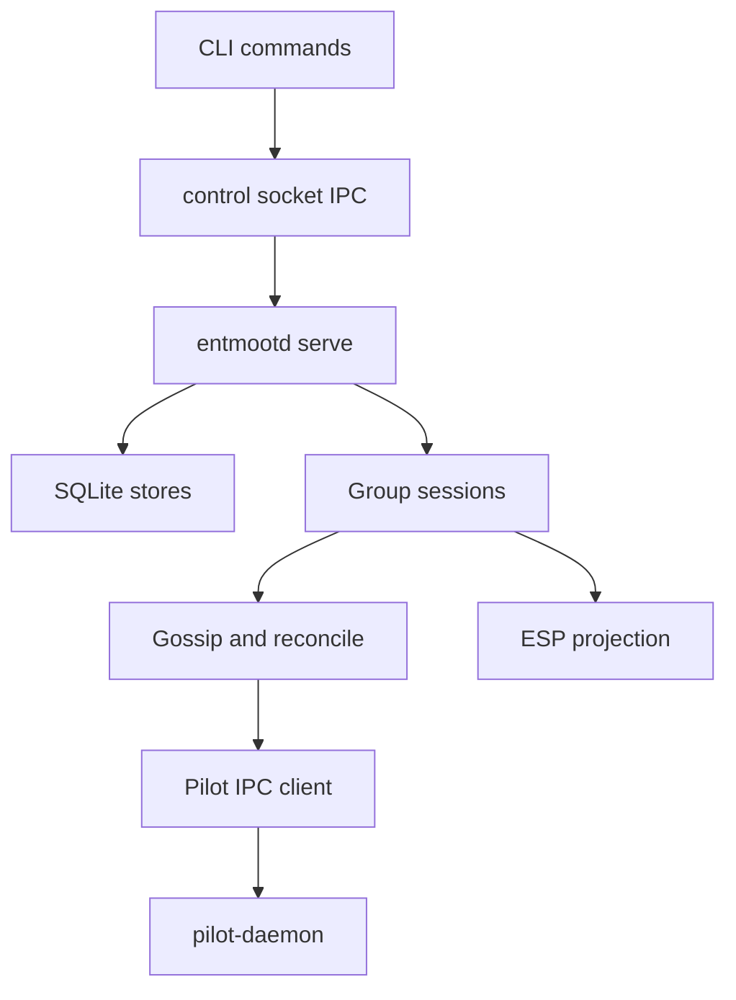

Entmoot is split into durable state, group logic, local IPC, and Pilot
transport.

The single-writer `serve` process prevents split-brain local state while one
shared Pilot transport serves multiple group sessions. `join` is the bootstrap
command that applies signed invites. Read-only commands such as `query`, `info`,
and `version` can run without `serve`.

ESP/mobile state is a projection around the same group sessions. Mailbox
cursors, sign requests, push tokens, group display metadata, and device
authorization live in ESP-local SQLite state. Protocol state remains in the
per-group stores and signed rosters.

Member profile gossip bridges the two layers: Entmoot signs the local Pilot
hostname as group-scoped display metadata, stores verified peer profiles, and
exposes them through ESP member APIs.
