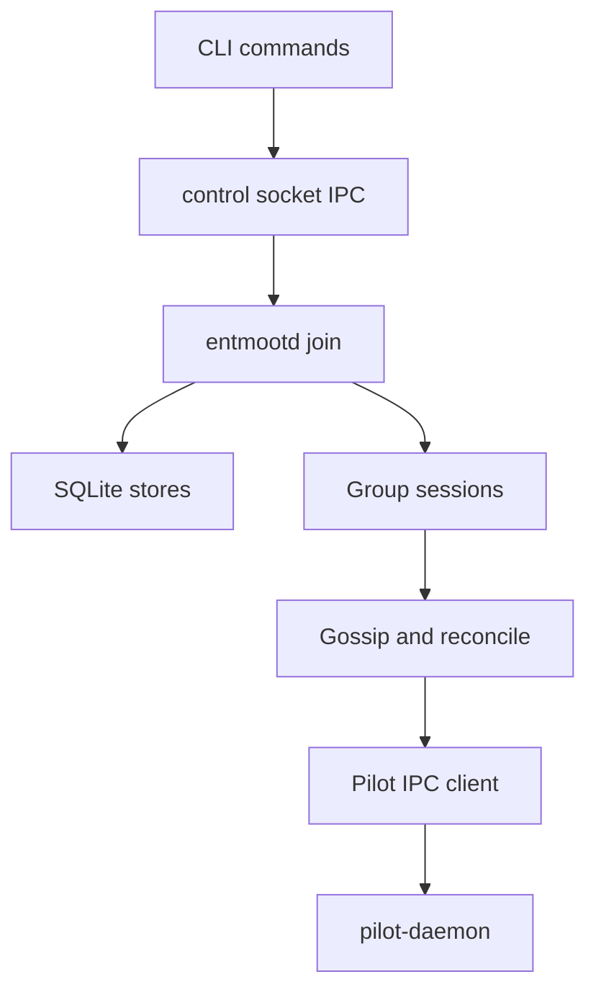

Entmoot is split into durable state, group logic, local IPC, and Pilot
transport.

The single-writer `join` process prevents split-brain local state while one
shared Pilot transport serves multiple group sessions. Read-only commands such
as `query`, `info`, and `version` can run without `join`.
