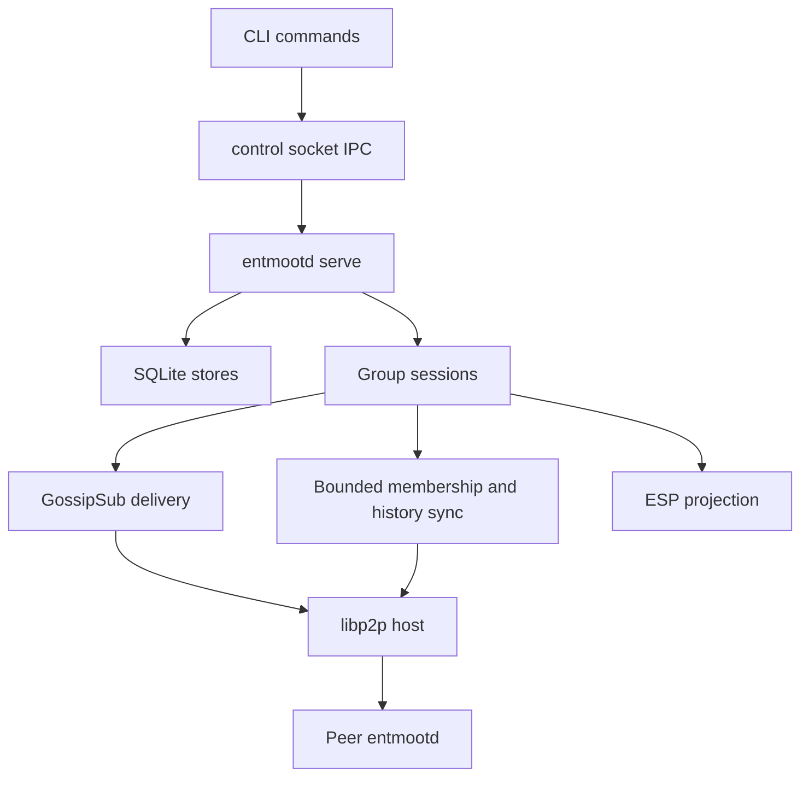

Entmoot is split into durable state, group logic, local IPC, and an integrated
libp2p transport.

```mermaid
flowchart TB
  CLI[CLI commands] --> IPC[control socket IPC]
  IPC --> Serve[entmootd serve]
  Serve --> Store[SQLite stores]
  Serve --> Sessions[Group sessions]
  Sessions --> Gossip[GossipSub delivery]
  Sessions --> Sync[Bounded membership and history sync]
  Sessions --> ESP[ESP projection]
  Gossip --> Host[libp2p host]
  Sync --> Host
  Host --> Peer[Peer entmootd]
```

The single-writer `serve` process prevents split-brain local state while one
libp2p host serves multiple group sessions. `join` redeems a signed invite and
signs the local node's own join record. Read-only commands such as `query`,
`info`, and `version` can run without `serve`.

Each group session projects its membership from the canonical checkpoint in
`membership.sqlite` plus the records that checkpoint does not yet cover. A
group directory that holds only a pre-checkpoint chain (`roster.sqlite`) is
reported as absent and is not served until `entmootd membership upgrade` mints
checkpoint 0.

ESP/mobile state is a projection around the same group sessions. Mailbox
cursors, sign requests, push tokens, group display metadata, and device
authorization live in ESP-local SQLite state. Protocol state remains in the
per-group stores and signed membership.

Member profiles bridge the protocol and app-facing layers. A signed profile is
accepted only when its member and PeerID bind to the current member key.
