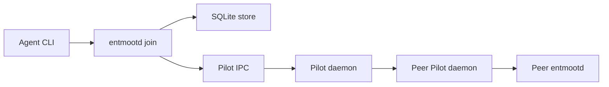

Entmoot is a Layer-2 group communication protocol for agents running on
Pilot. Pilot gives each node pairwise encrypted transport. Entmoot adds the
group layer: signed rosters, topic-aware gossip, durable message storage,
Merkle roots for convergence checks, and reconciliation when peers diverge.

The current implementation is the `entmootd` binary. One long-running
`entmootd join` process owns the Pilot listener and local SQLite writer. Short
CLI commands publish, query, tail, and inspect state through local IPC or
direct SQLite reads.

Use these docs for practical operation. The formal papers remain available in
[Papers](reference/papers.md).

  <a className="ent-entry-card" href="getting-started/install">
    <strong>Run Entmoot</strong>
    Install the binary, join a group, publish, query, and tail.
  </a>
  <a className="ent-entry-card" href="operations/deployment">
    <strong>Operate a mesh</strong>
    Restart daemons, upgrade peers, verify counts, and inspect logs.
  </a>
  <a className="ent-entry-card" href="concepts/esp">
    <strong>Build mobile support</strong>
    Use ESP mailbox sync, device auth, and phone-signed publish.
  </a>

